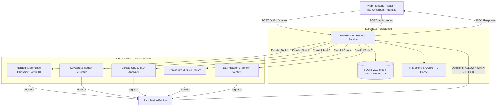

# SancharSaathi: System Architecture & Implementation Report

---

## 1. Executive Summary

**SancharSaathi** is a high-throughput, multi-signal SMS & URL threat detection platform. It combines RoBERTa deep learning semantic classifiers, deterministic keyword heuristics, lexical URL analyzers, dynamic threat intelligence, and TRAI/DLT sender identity verification within an asynchronous, SLA-bounded orchestration pipeline.

The platform provides actionable security decisions (**ALLOW**, **WARN**, **BLOCK**) with human-readable explanations, interactive user sandboxing, and persistent incident reporting.

---

## 2. End-to-End System Architecture

---

## 3. Subsystem Breakdown & Components

### 3.1. Frontend Web Client (`/frontend`)
- **Technology Stack:** React 18, TypeScript, Vite, Cyberpunk CSS Design System.
- **Key Features:**
  - **Neon Cyberpunk Aesthetic:** Ambient glow layers, cyan/magenta styling, and `backdrop-filter: blur(16px)` glass panels.
  - **Diagrammatic Signal Hub:** Replaced plain text lists with a radial node topology centered on the Core Viability/Risk Index.
  - **Mobile-First Touch Targets:** Interactive Sandbox buttons (`PROCEED`, `DISMISS`, `REPORT SPAM`) optimized for Android touch viewports (48px height, 44px min width).
  - **Team Credits:** Positioned in the bottom-left corner (*Tentan, Dyuti, Raghib, Shivam, Mayuri*).

### 3.2. Orchestrator Service (`/backend/services/orchestrator.py`)
- **Technology Stack:** FastAPI, Asyncio, Pydantic, HTTPX.
- **Pipeline Workflow:**
  1. **Sanitization & Normalization:** Cleans message text, resolves protocol-relative URLs (`www.` -> `http://`).
  2. **Cache Check with TTL Eviction:**
     - **24 Hours (86,400s):** Clean, low-risk messages.
     - **1 Hour (3,600s):** Messages containing external links.
     - **Permanent:** High-risk threat overrides and confirmed spam.
  3. **Parallel Task Execution:** Dispatches all 5 analyzer tasks concurrently using `asyncio.gather` with strict timeouts (0.5s–0.8s).
  4. **Dynamic SLA & Fault Tolerance:** If an analyzer times out or fails, active weights normalize across available engines without failing the scan.

### 3.3. Database & Concurrency (`/backend/database.py`)
- **SQLite Write-Ahead Logging (WAL):** Initialized with `PRAGMA journal_mode=WAL;` and `timeout=15.0` to eliminate `database is locked` concurrency errors under high-load writes.

### 3.4. Multi-Signal Analyzers (`/backend/services/analyzers.py`)

| Analyzer | Core Logic | Base Weight | Failure Mode / SLA |
| :--- | :--- | :--- | :--- |
| **RoBERTa Classifier** | Deep learning contextual transformer on port 8001 | 35.0–40.0 | 0.8s SLA; returns neutral fallback on timeout |
| **Keyword Analyzer** | Regex matching for urgency, financial lures, and lottery patterns | 15.0–35.0 | 0.5s SLA; zero weight on clean text |
| **URL Lexical Analyzer** | High entropy detection, IP-based hostnames, and suspicious TLDs (`.tk`, `.xyz`, etc.) | 20.0–30.0 | 0.5s SLA; zero weight if no URLs found |
| **Threat Intel Engine** | Google Web Risk lookup, URLHaus feed, SSRF shield, dynamic domain age & traffic rank algorithms | 15.0–50.0 | 0.8s SLA; non-blocking fallback heuristics |
| **Identity Verifier** | Indian Telecom TRAI DLT header validation (`VK-SBIIN`, `AD-HDFCBK`, etc.) and brand spoofing checks | 10.0 | 0.5s SLA; skips if no sender provided |

---

## 4. Risk Fusion Algorithm & Math Fixes

### 4.1. Single-Signal Inflation Fix
Previous implementations divided raw contributions only by the sum of *active* weights, causing single-trigger messages (e.g. text without URLs) to inflate to BLOCK.

**Corrected Formula:**
$$\text{Raw Score} = \sum_{s \in \text{Signals}} \left( \text{Confidence}(s) \times \text{Weight}(s) \right)$$
$$\text{Final Score} = \left( \frac{\text{Combined Score}}{\text{Total Base Weight } (100.0)} \right) \times 100.0$$

*When an analyzer finds no threat, its confidence is 0.0, but its base weight stays in the divisor to ensure single signals do not trigger false positive BLOCK decisions.*

### 4.2. Decision Thresholds

| Risk Score Range | Risk Level | Decision | User Experience |
| :--- | :--- | :--- | :--- |
| **0.0 – 39.9** | `LOW` | **ALLOW** | Clean state; content displayed normally. |
| **40.0 – 79.9** | `MEDIUM` | **WARN** | Cyberpunk Sandbox Guard with Proceed, Dismiss, and Report Spam. |
| **80.0 – 100.0** | `HIGH` | **BLOCK** | Red alert banner; access prevented. |

---

## 5. Automated Verification Summary

All tests executed via `scratch/test_api.py` passed with exit code `0`:
1. Clean SMS messages $\rightarrow$ **ALLOW (31.7)**
2. Urgent text-only SMS $\rightarrow$ **ALLOW (35.1)** *(Single-signal inflation successfully prevented)*
3. Registered Indian DLT Header (`VK-SBIIN`) $\rightarrow$ **ALLOW (31.6)**
4. Phishing with spoofed sender & unranked domain $\rightarrow$ **BLOCK (88.0)**
5. Suspicious TLD (.tk) $\rightarrow$ **WARN (45.3)**
6. SSRF Localhost/Metadata attacks $\rightarrow$ **BLOCK (98.0)**
7. SQLite WAL telemetry logging $\rightarrow$ **Status 200 OK**
